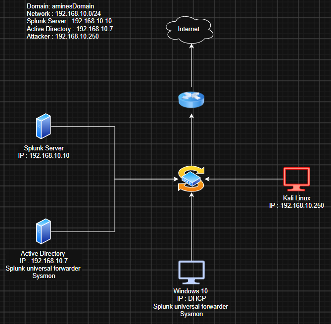

# Lab Architecture

## Network

- **Domain:** `aminesDomain`
- **Network:** `192.168.10.0/24` (VirtualBox NAT Network, isolated lab)

| Host | IP | Role |
|---|---|---|
| Splunk Server (Ubuntu) | 192.168.10.10 | SIEM / log collection |
| Domain Controller (Windows Server) | 192.168.10.7 | Active Directory, DNS |
| Windows 10 | DHCP | Domain-joined workstation |
| Kali Linux | 192.168.10.250 | Attack machine |

## Telemetry pipeline

```
Windows endpoints (DC + Win10)
  ├── Sysmon                → detailed endpoint events (process, network, process-access…)
  └── Windows Event Logs    → Security, System, PowerShell operational
        │
        └── Splunk Universal Forwarder → Splunk indexer (192.168.10.10) → search & detections
```

## Telemetry sources collected

| Source | Purpose | Status |
|---|---|---|
| Sysmon Operational | Process creation, process access, network, named pipes | ✅ |
| Windows Security | Logons, account changes, Kerberos | ⬜ verify |
| PowerShell Operational (script-block, EID 4104) | PowerShell content logging | ⬜ enable |

## Diagram




## Notes / lessons

- Lab network blocks outbound DNS to public resolvers (8.8.8.8); endpoints use the local network resolver instead.
- Snapshots taken at "baseline" state on every VM for reverting between experiments.
